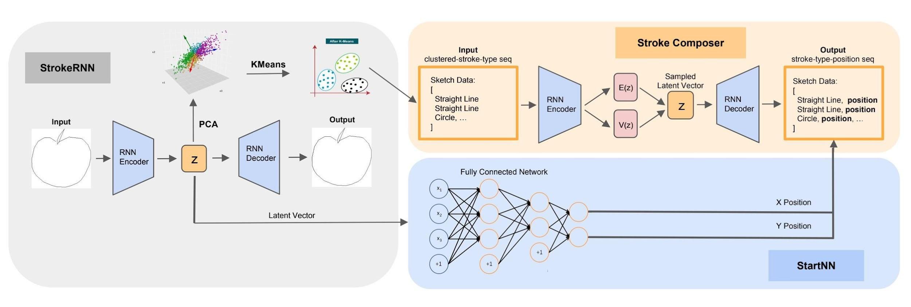

# Sketch-Composer
Repo for CSCI-2470 Final Project.

We study the sketch generating problem. Sketch-RNN proposed to a recurrent neural network (RNN) to construct sketches of common objects. The model is trained on a dataset of human-drawn sketches representing many different classes. In their paper, a sketch is represented as a sequence of moving points, and they applied a seq2seq VAE architecture to train the model from end to end. However, sketches, as a special kind of image data, contain rich visual and spatial information. To capture such visual feature, we propose to apply convolutional neural network to provide auxiliary information for the system. Moreover, empirically RNNs even LSTM can’t perfectly handle extremely long sequences. While human-drawn sketches often contains more than 400 points. This poses difficulty on the training process. Therefore we propose decompose the sketch into strokes (usually no more then 20), and then generate the sketch by composing these strokes.
Model architecture is shown below:

[Poster](./Poster.pdf)

